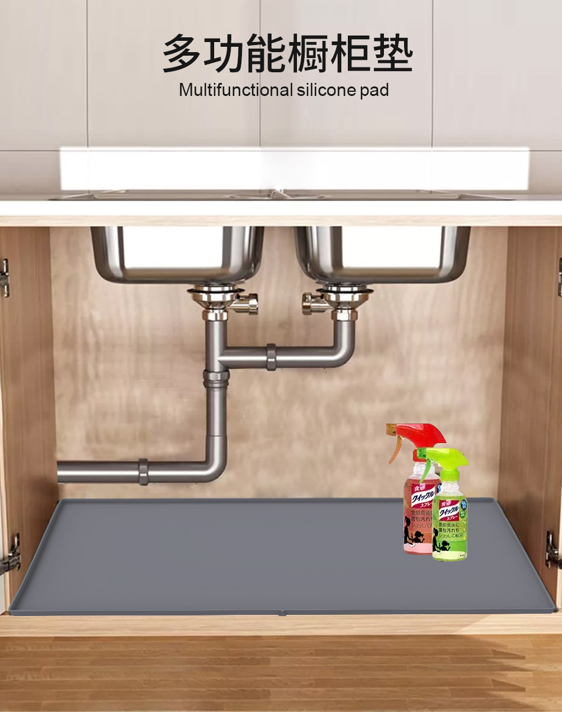

哎哟，是不是又在厨房把东西洒得到处都是？又是油，又是水的，看得我都头疼。😫 别担心，这款北欧硅胶防油防漏下水槽垫就像是一只穿着斗篷的超级英雄，敢于面对任何厨房的恶劣环境！🏆

垫子的材质是硅胶，这就像是它的超能力，能够抵挡油和水的攻击。让你的橱柜再也不用担心被这些恶劣的“敌人”侵袭啦！💪 这个垫子也是可降解的，让你在保护家园的同时，也能为保护地球做出贡献。🌍💚

这款垫子有圆形和方形两种形状，以及深灰色、灰色和黑色三种颜色。无论你的橱柜是什么样子，总有一款能满足你的需要。😎

而且，这个垫子在欧洲销售得非常好。你知道欧洲人有多么注重生活质量，所以这个垫子绝对是品质的保证。👍

价格段在50-60元，这样一来，你可以在保护橱柜的同时，也不会让钱包受伤。💰💰

所以，各位朋友，这款北欧硅胶防油防漏下水槽垫真的是你的橱柜的救星，同时也是你负责任的生活方式的最好伙伴。快点把它带回家吧！😁👍🎉

| 属性名称         | 属性值                                     |
| -------------- | ---------------------------------------- |
| 产品标题         | 北欧硅胶防油防漏下水槽垫橱柜垫子收纳防水沥水垫隔热垫鞋柜垫 |
| 材质            | 硅胶                                     |
| 图案            | 纯色                                     |
| 产品上市时间      | 2020年秋                                  |
| 价格段           | 50-60元                                  |
| 颜色            | 深灰色, 灰色, 黑色                           |
| 形状            | 圆形, 方形                                 |
| 主要销售地区      | 欧洲                                     |
| 产品质量等级      | 优等品                                    |
| 是否跨境出口专供货源 | 是                                       |
| 风格            | 现代简约                                   |
| 规格            | 870mm*560mm, 711mm*560mm, 790mm*560mm       |
| 是否插电         | 否                                       |
| 是否可降解        | 是                                       |

