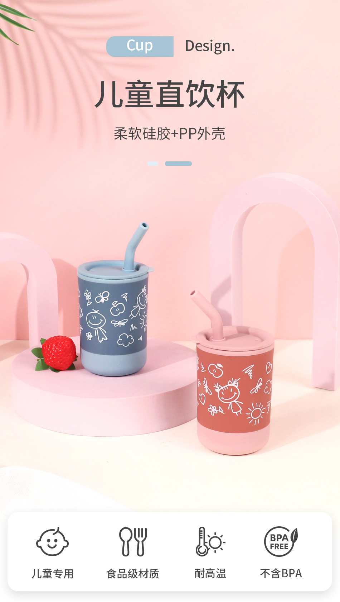

对于家里有小宝宝的你，这款儿童硅胶吸管杯可是家庭必备神器哦！😉🎁

首先，让我们看看它的外形，圆润可爱的形状，宝宝的小手拿起来非常方便。不带柄的设计，让宝宝更好地学习独立饮水。👼💪

不仅如此，这款吸管杯的材质是硅胶，防摔性超强，你不用担心宝宝一不小心把杯子摔落地。而且，它还防烫，让你的宝宝可以安全喝热饮。🔥🚫

还有，这款吸管杯的颜色丰富，粉色、绿色、蓝色，你可以根据你的宝宝的喜好选择。🎨🌈

它只有0.135kg，轻巧便携，不论是在家中、在公园，或是在旅途中，宝宝都能随时随地享受到饮水的乐趣。🚀👜

最后，这款吸管杯适用于6个月以上的宝宝，让你的宝宝从小就能学会自我饮水，增强自我生活能力。👶👏

对于追求品质生活的你，这款硅胶吸管杯无疑是你的最佳选择。快来亚马逊带一款回家吧！🏡🛍️

| 属性名称         | 属性值                                     |
| -------------- | ---------------------------------------- |
| 产品标题         | 亚马逊爆款儿童硅胶吸管杯创意婴儿学饮杯防摔防烫宝宝硅胶水杯     |
| 货号            | WF-202304                               |
| 品牌            | 其他                                     |
| 加印LOGO        | 可以                                     |
| 形状            | 圆形                                     |
| 口径规格         | 标准口径                                   |
| 是否带柄         | 不带柄                                    |
| 是否进口         | 否                                       |
| 材质            | 硅胶                                     |
| 产地            | 东莞                                     |
| 用品品类         | 水杯/训练杯                                |
| 适用年龄         | 6个月以上                                  |
| 颜色            | 粉色                                     |
| 商品条形码        | 0000                                   |
| 容量            | 粉色, 绿色, 蓝色                              |
| 是否跨境出口专供货源 | 是                                       |
| 主要下游平台      | ebay, 亚马逊, wish, 速卖通, 独立站, LAZADA     |
| 主要销售地区      | 欧洲, 南美, 东南亚, 北美, 东北亚, 中东          |
| 有可授权的自有品牌  | 否                                       |
| 单位重量         | 0.135kg                                  |

